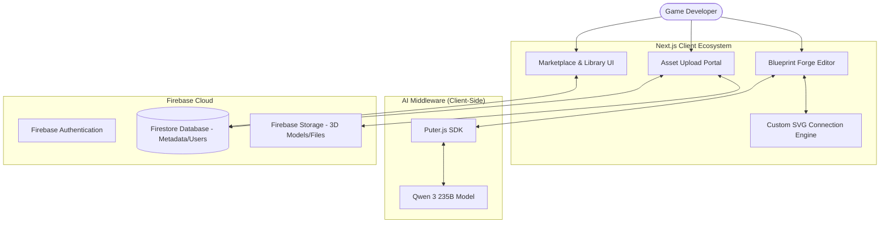
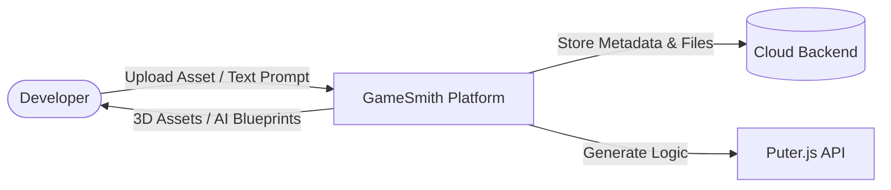
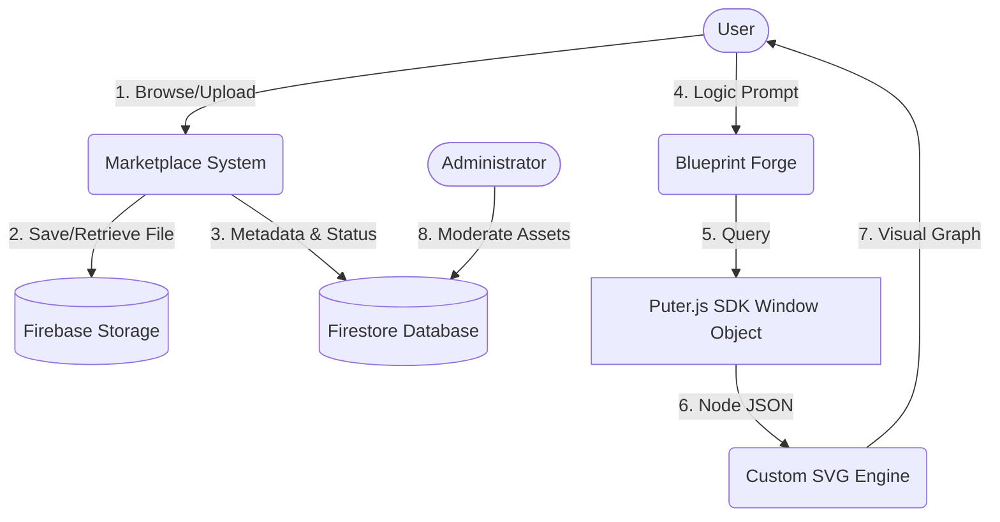
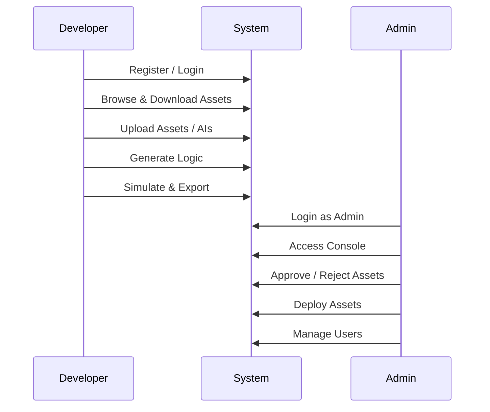
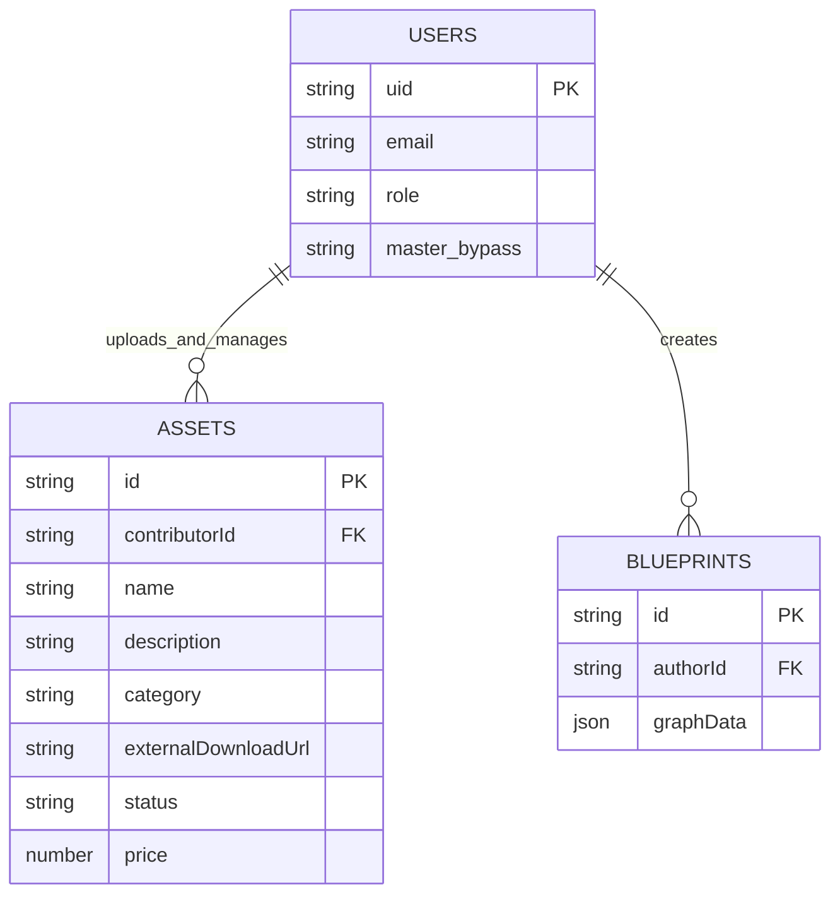

# GameSmith: Project Report

## 1. Abstract
GameSmith is a comprehensive, AI-driven game developer ecosystem that combines a robust digital marketplace with advanced developer tools. It empowers creators by providing a platform to discover, share, and upload game assets (3D models, audio, logic scripts), while also offering exclusive, first-party Game AIs and 3D assets. A standout feature of the platform is the "Blueprint Forge," an AI-powered web tool that translates natural language into functional, Unreal Engine-inspired visual node graphs. By leveraging the client-side Puter.js SDK for zero-cost AI generation, GameSmith serves as a unified hub for rapid game prototyping, resource acquisition, and community collaboration.

---

## 2. Introduction
**Background of the Problem:** Modern game development requires a vast array of resources—from 3D models and textures to complex AI behaviors and logic scripts. Developers often have to source these assets from fragmented marketplaces, and then write the underlying logic from scratch, leading to extended development times.
**Need for the System:** There is a strong need for a unified platform that not only hosts community-driven and high-quality first-party game assets, but also provides integrated developer tools (like an AI logic generator) to help seamlessly piece those assets together.
**Objectives:** 
- To create a decentralized marketplace where users can upload, share, and monetize 3D assets and logic.
- To provide high-quality, first-party 3D assets and pre-trained Game AIs.
- To offer the "Blueprint Forge," an intuitive visual interface for zero-cost, AI-automated logic synthesis.
- To ensure platform integrity and quality control through a secure Overwatch Admin Console.

---

## 3. Problem Statement
Independent game developers struggle with the fragmented nature of asset acquisition and the steep learning curve associated with visual scripting engines. Existing asset marketplaces lack integrated AI tooling to assist developers in implementing the assets they download. A unified ecosystem is required to merge a community-driven asset repository with an AI-driven developer toolkit that automates game mechanics generation.

---

## 4. Scope of the Project
**Included:**
- **Asset Marketplace:** A robust library for browsing, purchasing, and downloading 3D assets, AIs, and templates.
- **User Upload Portal:** A dedicated pipeline for developers to upload, categorize, and share their own creations.
- **First-Party Content:** Exclusive game AIs and 3D models developed and provided natively by GameSmith.
- **AI Blueprint Generator (Playground):** Text-to-node-graph synthesis using the client-side Puter.js AI SDK.
- **Interactive Canvas:** A custom-built SVG engine for viewing and simulating logic graphs.
- **Overwatch Console:** An administrative dashboard for strict moderation, asset approval, and role-based access management.

**Excluded:**
- Direct in-browser 3D rendering and physics simulation of complex user-uploaded FBX/OBJ files (the platform handles distribution and metadata, while the logic is simulated in 2D).

---

## 5. Literature Survey
**Existing Systems:**
- **Unity Asset Store / Unreal Marketplace:** Excellent for finding assets, but they strictly function as storefronts and lack built-in AI logic generators for rapid in-browser prototyping.
- **General AI Chatbots (ChatGPT/Claude):** Provide text-based C++ or C# code, but lack a marketplace ecosystem and the spatial awareness required to generate visual node graph structures.

**GameSmith's Unique Proposition:** GameSmith is unique in marrying the asset distribution model with a proprietary developer tool (Blueprint Forge). Developers can download a 3D asset from the marketplace and immediately use the Forge to generate its behavior logic on the same platform.

---

## 6. Proposed System
**Overview:** GameSmith is a dual-purpose platform: a **Developer Marketplace** and an **AI Toolset**. Users can download first-party AIs and 3D assets, upload their own creations to the community, and use the Blueprint Forge to generate complex gameplay logic visually.

**Advantages over existing systems:**
- **Centralized Workflow:** Combines asset sourcing and logic prototyping.
- **Zero API Costs:** Utilizes Puter.js anonymous mode for free client-side AI inference.
- **Community-Driven & First-Party:** Offers a mix of curated official assets and community-generated content.

---

## 7. System Architecture
The system employs a full-stack Next.js architecture, utilizing Firebase for robust asset storage and data management, and shifting AI inference to the client browser.



---

## 8. Data Flow Diagram (DFD)

### Level 0 (Context Diagram)


### Level 1 (Detailed DFD)


---

## 9. Modules Description

### 1. Marketplace & Asset Library Module
- **Description:** The storefront for GameSmith.
- **Functionality:** Handles the display, categorization, and distribution of user-uploaded and first-party 3D assets, audio, and Game AIs. Integrates with Firestore for querying asset metadata.

### 2. User Upload & Contribution Module
- **Description:** The portal for community contributions.
- **Functionality:** Allows creators to upload their resource files to Firebase Storage, defining metadata (price, description, type, download URLs). Assets enter a "Pending" state for moderation.

### 3. Blueprint Forge (Developer Tool) Module
- **Description:** The AI-powered logic canvas.
- **Functionality:** Utilizes the Puter.js SDK (`window.puter.ai.chat`) to generate Blueprint JSON maps from text. A custom React SVG engine renders draggable nodes and Bezier connections, complete with a live "Engine Tick" execution simulator.

### 4. Overwatch Console (Admin) Module
- **Description:** Dashboard for platform governance.
- **Functionality:** Secured via Firebase Role-Based Access Control (RBAC). Allows administrators to view global metrics, moderate uploaded assets (Approve/Reject/Purge), and manage network identities.

---

## 10. System Design

### Use Case Diagram


```

### Database Design (ER Diagram)


---

## 11. Technology Stack Explanation
- **Frontend Ecosystem:** **Next.js 15 (React 19)** serves as the core framework. **Tailwind CSS** and **Radix UI** provide a sleek, dark-themed developer aesthetic.
- **Backend & File Hosting:** **Firebase Cloud Storage** handles the heavy lifting of storing 3D models and large files, while **Firestore** handles real-time database queries and metadata. **Firebase Auth** manages sessions.
- **AI Integration:** **Puter.js SDK** provides free, anonymous access to the **Qwen 3 235B** model, executing logic generation directly in the client's browser.
- **Canvas Engine:** Pure **React DOM and SVG** rendering for the Blueprint Forge, ensuring high performance without third-party graph dependencies.

---

## 12. System Working
**A Typical Developer Workflow:**
1. **Sourcing:** A developer logs in and browses the Marketplace. They download a GameSmith 1st-Party "Cyber Demon 3D Model".
2. **Uploading:** They decide to contribute back by navigating to the Upload portal and submitting their custom "Sci-Fi Sound Pack" to the community.
3. **Logic Generation:** They navigate to the Blueprint Forge (Developer Tool) to create behavior for the Cyber Demon.
4. **AI Synthesis:** They prompt: *"If health < 50, trigger enraged mode and play sound."* Puter.js returns the strictly formatted JSON node graph.
5. **Simulation:** The custom SVG canvas renders the nodes. The developer presses "Play" to watch the execution pulse travel across the wires, validating the logic visually.

---

## 13. Implementation Details
- **Unified Cloud Infrastructure:** Firebase seamlessly bridges the Marketplace (Storage/Firestore) with the Developer Tools (Auth/Saves).
- **Zero-Cost AI Architecture:** By shifting the logic inference burden to Puter.js in the browser, the platform scales infinitely without API cost concerns.
- **Admin Moderation Queue:** Community uploads default to a "pending" status. The Overwatch Console allows Admins to review technical documentation and URLs before authorizing public visibility.

---

## 14. Testing

| Test Type | Description | Expected Result | Status |
| :--- | :--- | :--- | :--- |
| **Asset Pipeline Testing** | Test Firebase Storage uploads and Firestore metadata linkage. | Assets appear in admin pending queue. | Pass |
| **AI Synthesis Testing** | Test Puter.js integration and JSON schema strictness. | Correct nodes are mapped to SVG elements. | Pass |
| **Canvas Performance** | Simulate 50+ nodes on the React/SVG engine. | Smooth 60fps panning and zooming. | Pass |
| **RBAC Security** | Access Overwatch Console with standard user privileges. | "Access Denied / Override Required" displayed. | Pass |

---

## 15. Results & Discussion
**Output:** GameSmith successfully operates as a holistic developer platform. The marketplace effectively categorizes 3D assets, audio, and Game AIs, while the Blueprint Forge provides an immediately accessible sandbox for prototyping.
**Discussion:** The integration of an asset marketplace alongside a functional, AI-powered developer tool sets GameSmith apart. Developers are no longer forced to switch between a storefront in their browser and a heavy IDE on their desktop just to conceptualize a mechanic.

---

## 16. Advantages & Limitations
**Benefits:**
- **Comprehensive Hub:** Everything from 3D models to AI logic is in one place.
- **Cost-Efficiency:** Free blueprint generation via Puter.js lowers the barrier for indie developers.
- **Quality Control:** Strong administrative tools ensure the marketplace remains free of low-effort spam.

**Drawbacks:**
- Generated Blueprint logic is currently conceptual and must be manually recreated within Unreal Engine (no direct `.uasset` binary export).
- In-browser 3D model viewing is not yet natively integrated, relying on thumbnail representations and external downloads.

---

## 17. Future Enhancements
- **Engine Plugin Integration:** Develop a native Unreal Engine 5 / Unity plugin capable of directly importing GameSmith assets and Blueprint JSON.
- **In-Browser WebGL Viewer:** Implement Three.js to allow developers to preview 3D marketplace assets interactively before downloading.
- **Asset Monetization System:** Implement Stripe integration to allow users to buy and sell premium assets, creating a thriving creator economy.

---

## 18. Conclusion
GameSmith is more than just a blueprint generator; it is a full-fledged game developer ecosystem. By successfully merging a community marketplace for 3D assets and Game AIs with state-of-the-art, AI-driven developer tools, it drastically accelerates the prototyping phase of game development. The platform proves that complex, professional-grade developer hubs can be built efficiently on modern web stacks, empowering the next generation of independent creators.

---

## 19. References
- Puter, *"Puter.js SDK Documentation,"* 2024. [Online]. Available: https://docs.puter.com
- Epic Games, *"Blueprints Visual Scripting,"* Unreal Engine 5 Documentation, 2024.
- Vercel, *"Next.js App Router Documentation,"* Next.js, 2024.
- Firebase, *"Cloud Storage & Firestore Documentation,"* Google, 2024.
